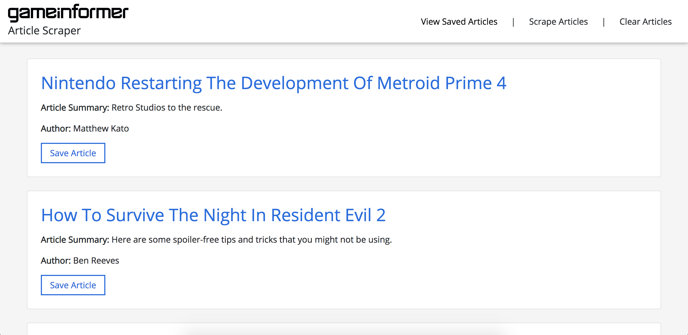

# Game Informer Scraper



#### About the App: 

The Game Informer Scraper is full-stack web app that scrapes the latest headlines from Game Informer's home page. After a headline is scraped, it can be saved and marked with notes written by the user.

<hr>

## Getting Started / Prerequisites

Make sure you have node.js installed on your computer. You can download it via the installer on the official site:

```
https://nodejs.org/en/download/
```

Then either clone or download this repository.

<hr>

## Installing

Navigate to the root directory of the cloned repository. Install the necessary dependencies by running the following command:

```
$ npm i
```

<hr>

## MongoDB

To run the app locally, you will need to have MongoDB installed on your computer. More info can be found on the [MongoDB site](https://docs.mongodb.com/manual/installation/).

<hr>

## Use the GI Scraper!

The deployed version of this app is hosted on heroku [here](https://game-informer-scraper.herokuapp.com/).

To use this app locally, navigate to the root directory of the cloned repository and enter `node server.js` into your terminal. This will set up a local server on your computer. After that, access the app by opening your web browser and visiting `http://localhost:8080/`.

To end the sever connection, press `ctrl + c` inside of your terminal.

<hr>

## Built With

* [Javascript](https://developer.mozilla.org/en-US/docs/Web/JavaScript)
* [Node.js](https://nodejs.org/en/)
* [MongoDB](https://www.mongodb.com/)
* [HTML5](https://developer.mozilla.org/en-US/docs/Web/Guide/HTML/HTML5)
* [CSS3](https://developer.mozilla.org/en-US/docs/Web/CSS/CSS3)
* [Bootstrap](https://getbootstrap.com/)

* [NPM Packages](https://www.npmjs.com/)
   1. [Express](https://www.npmjs.com/package/express)
   2. [body-parser](https://www.npmjs.com/package/body-parser)
   3. [Express-Handlebars](https://www.npmjs.com/package/express-handlebars)
   4. [Cheerio](https://www.npmjs.com/package/cheerio)
   5. [Request](https://www.npmjs.com/package/request)

<hr>

## Authors

* **Jacob Moore** - [Game Informer Scraper](https://github.com/jrmoore117/Game-Informer-Scraper)